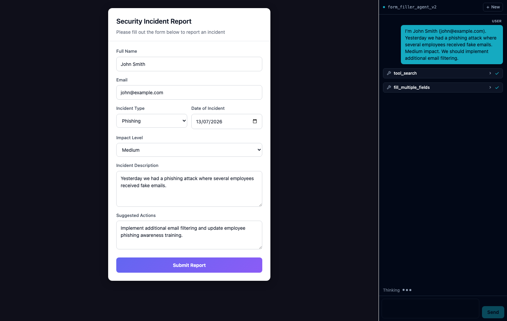

# Form Filler sample (Angular)

The Angular twin of [`samples/form-filler`](../form-filler) — an AI assistant
that fills a security-incident report from plain conversation. Same agent, same
tools, built on **`@distri/angular`** instead of `@distri/react`.



---

## 1. Configure

Copy the example env and fill in your API key:

```bash
cp .env.example .env
```

```ini
# .env — server-side only. No VITE_/NG_ prefix, so it is never bundled.
DISTRI_API_KEY=dak_…                  # app.distri.dev → Settings → API Keys
DISTRI_BASE_URL=https://api.distri.dev/v1
DISTRI_WORKSPACE_ID=…                 # the workspace you push the agent to
```

> **The API key never reaches the browser.** The Angular dev server
> (`proxy.conf.cjs`) holds it, exchanges it for a **short-lived token** via
> `POST {DISTRI_BASE_URL}/token`, and serves that at `/api/distri/token`. Only
> that short-lived token is sent to the frontend. `.env` is gitignored.

Your workspace also needs a **default model configured** (Settings → Models).
The agent deliberately pins no model, so it uses the workspace default.

## 2. Push the agent

The agent definition lives in
[`agents/form_filler_agent_v2.md`](./agents/form_filler_agent_v2.md). Push it
with the distri CLI:

```bash
set -a; source .env; set +a           # exports DISTRI_API_KEY / BASE_URL / WORKSPACE_ID
distri agents push agents/form_filler_agent_v2.md
```

Expected output:

```
Pushing agent to: https://api.distri.dev/v1/agents (workspace: 802f40a5-…)
https://api.distri.dev/v1/agents/form_filler_agent_v2
```

Verify it landed:

```bash
distri agents list | grep form_filler_agent_v2
```

Re-run `distri agents push` after **every** edit to the `.md` — it is not
watched.

## 3. Run

```bash
pnpm --filter @distri/form-filler-angular-sample dev
```

Open <http://localhost:4200> and click the suggested prompt (or type your own):

> "I'm John Smith (john@example.com). Yesterday we had a phishing attack where
> several employees received fake emails. Medium impact. We should implement
> additional email filtering."

The agent extracts the details, calls the form tools, and the fields populate
one by one.

---

## How it works

| Piece | What it does |
|---|---|
| `src/app/app.config.ts` | `provideDistri({ tokenEndpoint: '/api/distri/token' })` — the Angular equivalent of React's `<DistriProvider>`. Fetches the token and wires up workspace + refresh. |
| `proxy.conf.cjs` | Dev-server auth: swaps `DISTRI_API_KEY` for a short-lived token, and proxies `/v1` to the backend (same-origin, so no CORS). |
| `src/app/incident-form.component.ts` | The form. Exposes `setValue`/`getValues`/`submit`/… which the parent reaches via `@ViewChild` — Angular's answer to React's `useImperativeHandle`. |
| `src/app/tools.ts` | The `DistriFnTool`s the agent calls. All are `autoExecute: true`; without it the SDK parks them awaiting a confirmation UI and nothing happens. |
| `agents/form_filler_agent_v2.md` | The agent definition you push in step 2. |

`<distri-chat>` (from `@distri/angular`) renders the transcript, the tool calls
(click a row to expand its input/result), the streaming indicator, and a Tiptap
composer. **+ New** starts a fresh thread.

## Gotchas

- **Workspace matters.** Agents are workspace-scoped and the short-lived token
  carries no workspace claim, so `DISTRI_WORKSPACE_ID` must be set — otherwise
  agent lookups 404 or the session fails with *"Workspace context required"*.
- **No model configured** in the workspace surfaces as *"Required secret
  'OPENAI_API_KEY' is not configured"* or Azure *`DeploymentNotFound`*. Fix that
  in Settings → Models, not here.
