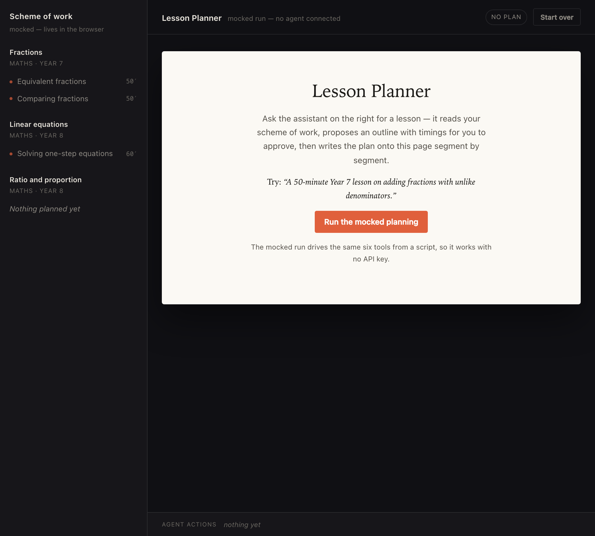
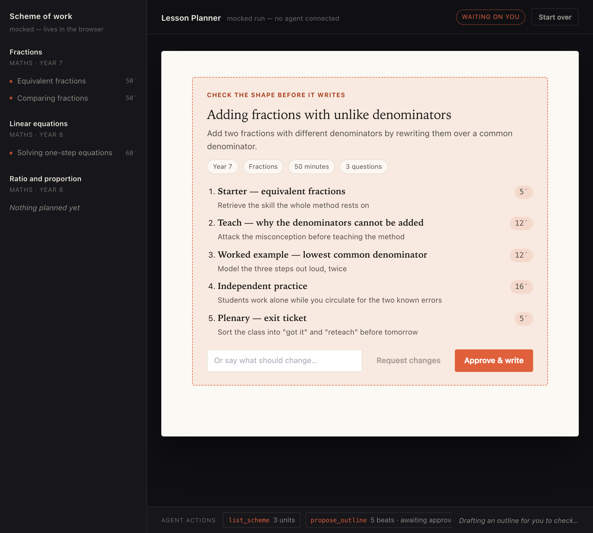
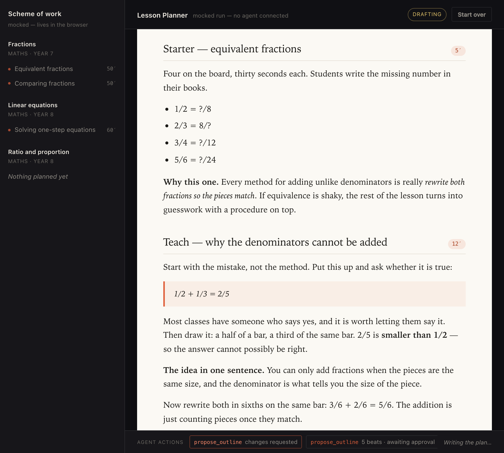
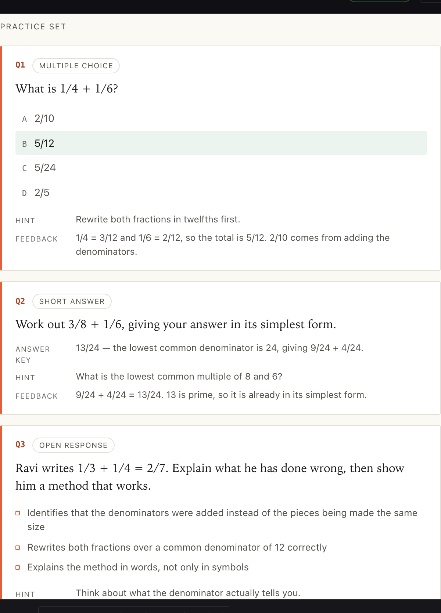
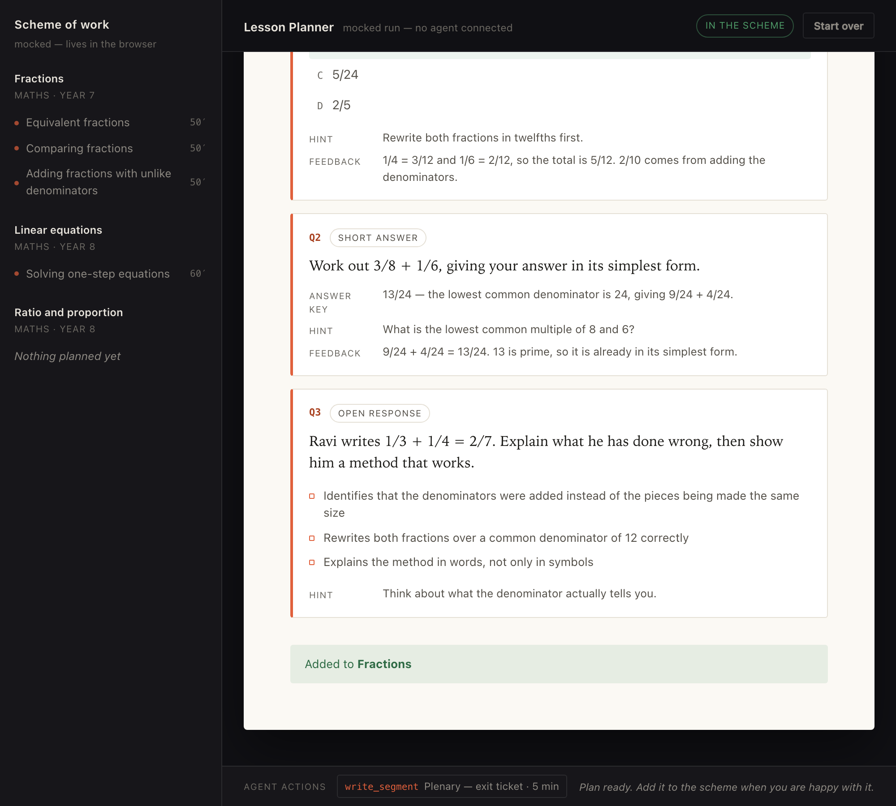

# Lesson Planner — an end-to-end generation flow in Distri

A teacher asks for a lesson. The agent reads their scheme of work, proposes a
**timed outline and waits for approval**, then writes the plan onto the page
segment by segment, adds a validated practice set, and files it back into the
scheme.

No backend. No database. The scheme of work is a module-level object in the
browser tab, and every action the agent takes is an **in-product tool** — an
ordinary async TypeScript function running in the same tab as your React state.



## Run it

```bash
# from distrijs/
cp samples/lesson-planner/.env.example samples/lesson-planner/.env   # set DISTRI_API_KEY
pnpm --filter @distri/lesson-planner-sample dev                      # http://localhost:5303
```

Get a key by signing up at [app.distri.dev](https://app.distri.dev/), then
register `agent.md` on that workspace so the agent id (`lesson_planner_agent`)
resolves — see [Managing agents](https://distri.dev/docs/managing-agents).

**No key?** Open it anyway and press **Run the mocked planning**. A script in
`src/mockRun.ts` drives the same six tools and the whole flow plays out —
approval gate included. That is not a shortcut for the demo; it is the point
(see [The tools are the contract](#5-the-tools-are-the-contract)).

## The flow, in five beats

Every screenshot below is captured by an automated run of the mocked flow, so it
cannot drift from what the app actually does.

### Outline first, and stop

The agent's first tool call is not writing — it is `propose_outline`, which
renders the shape of the lesson and then **blocks**. Nothing is written until a
human says go, and "say what should change" sends the note back to the agent,
which revises and proposes again.

The tool also rejects an outline whose beats do not add up to the lesson length,
so a 50-minute lesson cannot arrive with 70 minutes of activities in it.



### Then it drafts

One `write_segment` per approved beat, streamed onto the page. What lands is
written **for the teacher** — what to put on the board, which wrong answer to
invite, what to circulate for — not for the student.



### The practice set validates

`add_question` runs the same checks a real question editor would — a
multiple-choice answer must be one of its own options, an open response must
carry a rubric. A malformed question never reaches the page.



### And filing writes back to the scheme

`add_to_scheme` adds a row to the mocked store, and the rail — a projection of
that store — gains the lesson.



## How it is put together

```
┌───────────────┐   ┌────────────────────────────┐   ┌──────────────────┐
│  Scheme rail  │   │        Plan canvas         │   │  <Chat> (Distri) │
│               │   │                            │   │                  │
│ mocked "DB"   │   │  outline gate → segments → │   │  the agent turn  │
│ units+lessons │   │  practice set → filed      │   │  streams here    │
└───────┬───────┘   └──────────────┬─────────────┘   └────────┬─────────┘
        │ renders                  │ renders                  │ calls
        └──────────► scheme.ts + planStore.ts ◄─────────────── tools.ts
                     plain observable state              6 in-product tools
```

One direction, no exceptions: **the agent moves state, the UI renders state.**
No component knows an agent exists, and no tool knows a component exists. That
is what makes the mocked run possible and what keeps the seventh tool a
one-file change.

| File | What it is |
|---|---|
| `src/tools.ts` | The six tools. Start here. |
| `src/planStore.ts` | The plan being written, plus the approval gate. |
| `src/scheme.ts` | The mocked backend. Swap for `fetch` and nothing else changes. |
| `src/mockRun.ts` | Scripted planning — the no-key demo and the testing pattern. |
| `src/App.tsx` | Layout, `<Chat>` wiring, context injection. |
| `src/components/PlanCanvas.tsx` | Outline gate, segments, question cards. |
| `src/components/SchemeRail.tsx` | The scheme of work, rendered from `scheme.ts`. |
| `agent.md` | The agent definition: the flow, the planning rules, the style. |
| `src/DistriTokenProvider.tsx` | Short-lived token fetch (see [auth](#the-api-key-never-reaches-the-browser)). |

Both stores are ~10 lines of subscribe/getSnapshot feeding React's
`useSyncExternalStore`. Deliberately not Redux or Zustand — so that nothing in
the interesting part of this sample is framework trivia. Use whatever you
already use.

## Integrating client-side functions

This is the part worth copying into your own app. Full reference:
[In-Product Tools](https://distri.dev/docs/guides/agent/in-product-tools).

### 1. Write the function you actually want called

Start from your app, not from the agent. A tool is a normal function.

```ts
// src/scheme.ts — no agent anywhere in sight
export function addToScheme(lesson: PlannedLesson): PlannedLesson { … }
```

### 2. Wrap it as a `DistriFnTool`

```ts
import type { DistriFnTool } from '@distri/core';

const fileIt: DistriFnTool = {
  name: 'add_to_scheme',
  description:
    'Add the finished plan to the department’s scheme of work. Only call this after the teacher asks you to.',
  type: 'function',
  parameters: {
    type: 'object',
    properties: {
      unit_id: { type: 'string', description: 'Unit to file it under. Defaults to the unit from the outline.' },
    },
  },
  handler: async ({ unit_id }: { unit_id?: string }) => {
    const unit = findUnit(unit_id ?? outline.unitId);
    if (!unit) return `Error: unknown unit_id "${unit_id}". Valid ids: ${unitIds().join(', ')}.`;
    addToScheme({ /* … */ });
    return `Added "${outline.title}" to ${unit.title}.`;
  },
};
```

`parameters` is JSON Schema — the same schema the model fills in. Describe every
property; an undescribed property gets guessed at.

### 3. Hand them to the chat

```tsx
import { Chat } from '@distri/react';

<Chat
  agentId="lesson_planner_agent"
  threadId={threadId}
  externalTools={lessonPlannerTools}   // ← the whole integration
/>
```

That is the entire wiring. Tools execute automatically when the agent calls
them, and the result goes back into the turn. If you are driving your own UI
instead of `<Chat>`, register them with the `useTools` hook or
`agent.addTool()` — see the
[React provider guide](https://distri.dev/docs/guides/client/react-provider).

### 4. Let the agent know they exist

Tools are only half the contract; `agent.md` is the other half. It names the
order to call them in and what "done" means:

```md
1. Ground yourself.   2. Outline, then stop.   3. Write it.
4. Set the practice.  5. Close.                6. File it only when asked.
```

See [Agent definition](https://distri.dev/docs/concepts/agent-definition).

### Four rules that decide whether tools behave

- **The description is the prompt.** The model picks a tool by reading its
  `description` and `parameters`. Vague description, wrong call.
- **Validate, and return the error as a string.** A returned error becomes the
  tool result, so the model corrects itself and retries. Throwing kills the turn.
- **Return what the model needs next** — ids, remaining counts, the next step —
  never `"ok"`.
- **Keep handlers boring.** A handler that moves state is testable; a handler
  that also renders is not.

## The five ideas worth stealing

### 1. Client-side tools

Handlers run in the browser, so they can touch React state, read IndexedDB, or
call an API the user is already signed in to — no server-side tool plumbing.
(For persistence, Distri also ships a
[browser IndexedDB toolset](https://distri.dev/docs/concepts/using-indexeddb).)

### 2. A human gate that needs no protocol support

The best beat in the flow is the outline review. `propose_outline` renders the
outline and then simply **does not resolve** until the teacher clicks a button:

```ts
proposeOutline(outline): Promise<ApprovalDecision> {
  set({ status: 'awaiting_approval', outline, awaitingApproval: true });
  return new Promise((resolve) => { approvalResolver = resolve; });
}
```

The agent is blocked on a tool result — a state the protocol already
understands. Approve and the tool returns "go"; ask for changes and it returns
the teacher's note, and the model revises and proposes again. Human-in-the-loop
in about fifteen lines.

### 3. Validation is what makes it self-correcting

```ts
const allocated = beats.reduce((sum, beat) => sum + beat.minutes, 0);
if (allocated !== input.minutes) {
  return `Error: the beats add up to ${allocated} minutes but the lesson is ${input.minutes} minutes. …`;
}
```

Returning that as a **string** hands it back to the model as the tool result, so
it fixes the arguments and retries. Timings that do not add up are the single
most common thing a human sends back, so the tool catches it before a human has
to.

### 4. Context injection beats asking

`beforeSendMessage` prepends the current scheme of work and plan state to every
message, so the agent always knows what exists and how far it got:

```tsx
<Chat beforeSendMessage={async (message) => ({
  ...message,
  parts: [{ part_type: 'text', data: `[Planner state]\n${JSON.stringify(context)}` }, ...message.parts],
})} />
```

Cheaper than a `list_scheme` round-trip every turn, and it removes a whole class
of "the agent forgot" bugs. See
[Overriding the user message](https://distri.dev/docs/concepts/overriding-user-message).

### 5. The tools are the contract

`src/mockRun.ts` calls the exact same handlers from a script. The app cannot
tell the difference — which is why the sample runs with no API key.

The same property makes an agentic UI **testable**, which is how the screenshots
above are made: a browser test drives the mocked run, asserts each beat, and
photographs it. Because tools are the contract, a test can be the caller — it can
even reach into the running module and call a handler directly:

```ts
const result = await page.evaluate(async (specifier) => {
  const mod = await import(/* @vite-ignore */ specifier);
  return mod.toolByName('add_to_scheme').handler({});
}, '/src/tools.ts');
```

No model in the loop, no flake, and a picture that only exists because the run
passed.

## The API key never reaches the browser

`vite.config.ts` installs the shared `distri-token-proxy` middleware. It reads
`DISTRI_API_KEY` from the Vite **server** process (no `VITE_` prefix, so Vite
will not inline it) and exchanges it for a short-lived token via
`POST {DISTRI_BASE_URL}/token`. The frontend fetches only that token. There is
deliberately no "just ship the key" fallback.

In production, do the same with one endpoint on your own server that mints a
token for the signed-in user. See
[API keys](https://distri.dev/docs/cloud/api-keys).

## Extending it

Adding a capability is one object in `tools.ts` plus whatever state it moves:

- `add_differentiation(segment_id)` — a support and a stretch note per segment.
- `check_prior_knowledge()` — read the scheme and flag what has not been taught.
- `make_worksheet()` — render the practice set as a printable.
- `book_room(date)` — the step after filing it.

You almost never need to touch `App.tsx` to add one.

## Learn more

- **[distri.dev/samples](https://distri.dev/samples)** — the sample gallery this
  one belongs to (form filler, data reconciliation, approval gate…).
- **[Getting started](https://distri.dev/docs/getting-started)** ·
  **[Intro](https://distri.dev/docs/intro)**
- **[In-product tools](https://distri.dev/docs/guides/agent/in-product-tools)** —
  the reference for everything in
  [Integrating client-side functions](#integrating-client-side-functions).
- **[React provider](https://distri.dev/docs/guides/client/react-provider)** ·
  **[Client API reference](https://distri.dev/docs/guides/client/api-reference)**
- **[Agent definition](https://distri.dev/docs/concepts/agent-definition)** ·
  **[Invocation methods](https://distri.dev/docs/concepts/invocation-methods)** ·
  **[Lifecycle events](https://distri.dev/docs/lifecycle-events)**
- **Sibling samples in this repo:** [`../form-filler`](../form-filler) (fill a
  form from conversation), [`../data-reconciliation`](../data-reconciliation),
  [`../../apps/task-stream-demo`](../../apps/task-stream-demo) (read-only task
  streaming).
